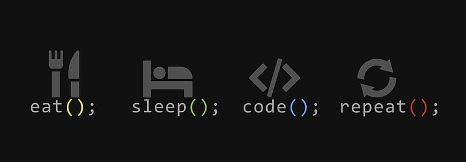

<h1 align="center">Hi 👋, I'm Gurbaaz Cheema</h1>
<h3 align="center">A passionate student pursuing a Bachelor of Computing at the University of Guelph.</h3>

Welcome to my GitHub profile! I'm Gurbaaz, a dedicated student with a love for coding and exploring new technologies. Currently, I'm honing my skills as a Bachelor of Computing student at the University of Guelph, eager to contribute to exciting projects and collaborate with like-minded individuals. Outside of coding, you can find me on the basketball court, where I enjoy playing and staying active.

- 📫 How to reach me **gurbaaz.cheema5@gmail.com**

- ⚡ Fun fact **I enjoy playing basketball**

<h3 align="left">Connect with me:</h3>

<h3 align="left">Languages and Tools:</h3>

       

<h3 align="left">Stats:</h3>

&nbsp;

